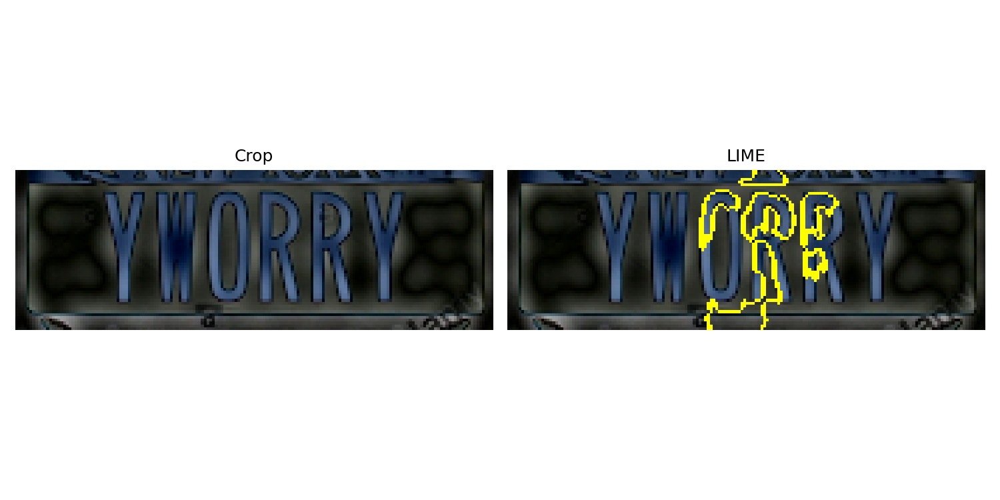

# Automatic License Plate Recognition with YOLO, OCR and Explainable AI

This repository contains the implementation of a pipeline for **Automatic License Plate Recognition (ALPR)** using **YOLOv8**, OCR, and **Explainable AI (XAI)** techniques.  
The project was developed as part of an academic exam and is documented in the paper:  
*“Automatic License Plate Recognition using Convolutional Neural Networks and Explainable AI”*.

---

## 📌 Project Structure

- `targa_detection.ipynb` → Main Jupyter Notebook containing the full pipeline
- `data/` → Original and preprocessed datasets
- `crops/` → Cropped license plates from YOLO detections
- `results/` → Metrics, OCR outputs and LIME visualizations
- `references.bib` → Bibliography file for the scientific article
- `main.tex` → LaTeX source of the article
- `README.md` → This file

---

## ⚙️ Pipeline Overview

The pipeline is divided into the following steps:

1. **Preprocessing**
   - Frequency domain filtering with FFT:
     - Low-pass filter (cutoff radii: 20, 30, 40)
     - High-pass filter (cutoff radii: 20, 30, 40)
   - Fuzzy filtering based on Sobel gradient magnitude and trapezoidal membership functions.
   - Baseline: no preprocessing.

2. **Dataset Preparation**
   - Source: [Kaggle – Car License Plate Detection](https://www.kaggle.com/datasets/andrewmvd/car-plate-detection)
   - Format conversion: Pascal VOC → YOLO
   - Train/val/test split with fixed seed for reproducibility.

3. **Detection with YOLOv8**
   - Model: YOLOv8n
   - Epochs: 50  
   - Batch size: 16  
   - Image size: 640  
   - Evaluation metrics: **Precision** and **Recall**

4. **Cropping**
   - Automatic cropping of detected license plates from YOLO predictions.

5. **OCR**
   - License plate transcription with [FastPlateOCR](https://github.com/sergiomsilva/alpr-unconstrained)  
   - Evaluation of transcription quality across preprocessing variants.

6. **Explainability (XAI)**
   - Application of **LIME** (Local Interpretable Model-agnostic Explanations) to cropped plates.
   - Identification of pixels and regions that mostly influenced YOLO’s predictions.

---

## 📊 Results (Summary)

- YOLO detection remained **robust** across all preprocessing variants (Precision > 97%, Recall between 65–88%).
- OCR performance drastically **dropped on preprocessed crops** (success rate < 10%).
- OCR on **original crops** was highly successful, confirming the importance of preserving fine details.
- LIME visualizations highlighted **edges and character regions** as most influential for YOLO detection.

---

## 🖼️ Examples

### YOLO Detection and Crops


### OCR Fail vs Success
| Real Plate | OCR (Preprocessed) | OCR (Original) |
|------------|---------------------|----------------|
| AB123CD    | A8I23OD             | AB123CD ✅      |

### LIME Explanations


---

## 🚀 How to Run

1. Clone this repository:
   ```bash
   git clone https://github.com/username/repo.git
   cd repo
   
2. Install dependencies:
   ```bash
   pip install -r requirements.txt
   
3. Open and run the notebook:
   ```bash
   jupyter notebook targa_detection.ipynb

